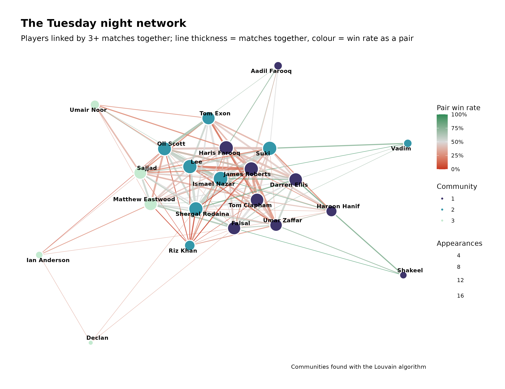

# Tuesday Night Football Analytics ⚽

A complete, reproducible analytics platform for Tuesday Night (Total)
Football: it ingests messy WhatsApp-style team sheets, standardises player
names, stores everything in a tidy relational database and serves a full
statistical review through a polished **web-based Shiny dashboard** — plus an
optional PDF annual report.



## What it does

- **Robust parsing** of intentionally messy team sheets: every bullet style,
  `Bibs` / `No Bibs` / `Non-bibs` / `## Bibs (8)n`, smart quotes, invisible
  unicode, trailing full stops, dates in any `d/m/yy` variant, match notes
  (`9/6/26- the fight`) and per-player events (`Umar Zaffar (red card)`).
- **Alias resolution**: `Matt` → Matthew Eastwood, `Rik` → Riz Khan,
  `Comical A-Lee` → Lee. Ambiguous first names (two Toms!) are resolved by
  elimination within the match and every automatic decision is logged for
  human review.
- **Tidy relational data model**: `matches`, `teams`, `players`,
  `appearances`, `events`, `player_aliases`, `parse_issues`.
- **Statistics**: match records, player metrics with 95% Wilson confidence
  intervals, streaks, pairwise partnerships, trio/quartet/quintet chemistry,
  head-to-head "who beats whom", network centrality (degree, betweenness,
  closeness, PageRank) with Louvain communities, time trends, retention, and
  automatically generated plain-English discoveries.
- **21 publication-quality figures** (ggplot2 house theme, BBC/prism
  inspired): heatmaps, networks, ridgelines, violins, lollipops, bump charts,
  alluvials, calendar heatmaps, timelines.

## The Shiny app

```r
shiny::runApp()        # from the project root
```

| Tab | What you get |
| --- | --- |
| **Dashboard** | headline value boxes, results timeline, attendance, auto-discovered facts |
| **Matches** | every match; click one for full team sheets and events |
| **Players** | searchable profiles, per-player timeline, full sortable stats table |
| **Compare** | two players side by side, as teammates *and* as rivals |
| **Partnerships** | best duos with confidence intervals, co-occurrence heatmap, trios→quintets |
| **Head-to-head** | who-beats-whom heatmap and full records |
| **Network** | interactive (plotly) network with plain-English measure explanations, centrality table |
| **Trends** | rolling win %, bib dominance, cumulative appearances |

The public app is **read-only** (it runs entirely in the browser as a
static shinylive site). Adding a new week's results is done through GitHub,
where only collaborators have write access: append the sheet — as messy as
you like — to `data-raw/team_sheets_raw.txt` on `main` and the site rebuilds
and redeploys itself with every statistic updated.

## Project layout

```
├── app.R                  # Shiny app (UI + server)
├── global.R               # app setup: packages, database, helpers
├── R/                     # the analytics package
│   ├── utils.R            #   shared helpers (Wilson CI, streaks, name keys)
│   ├── parse.R            #   messy team sheet parser
│   ├── aliases.R          #   alias table + ambiguity resolution
│   ├── database.R         #   tidy relational model, save/load
│   ├── stats_match.R      #   match-level statistics
│   ├── stats_player.R     #   player metrics + rankings
│   ├── stats_pairs.R      #   pairwise partnerships, co-occurrence
│   ├── stats_chemistry.R  #   trios/quartets/quintets, line-up stability
│   ├── stats_h2h.R        #   head-to-head (opposing players)
│   ├── stats_network.R    #   igraph/tidygraph network + centrality
│   ├── stats_time.R       #   trends, retention, rolling win %
│   ├── discoveries.R      #   auto-generated plain-English facts
│   ├── theme.R            #   ggplot house style + palette
│   └── plots.R            #   the 21-figure library
├── data-raw/
│   ├── team_sheets_raw.txt    # the messy source of truth (append-only)
│   └── player_aliases.csv     # alias lookup table
├── data/                  # tidy tables (rds + csv), rebuilt by the pipeline
├── figures/               # rendered figures
├── reports/tnf_report.Rmd # optional PDF annual review (+ rendered pdf)
├── scripts/build_all.R    # one-shot pipeline
├── tests/                 # testthat unit tests
└── docs/assumptions.md    # every assumption, documented
```

## Installation

```r
# R >= 4.3. Core dependencies:
install.packages(c(
  "tidyverse", "lubridate", "shiny", "bslib", "DT", "plotly",
  "igraph", "tidygraph", "ggraph", "ggrepel", "ggridges", "ggalluvial",
  "patchwork", "viridis", "scales", "testthat", "rmarkdown", "kableExtra"
))
# optional niceties (used automatically when present):
install.packages(c("ggprism", "gt", "reactable", "janitor"))
```

An `renv.lock` capturing the exact versions used to build this repository is
included; with [renv](https://rstudio.github.io/renv/) installed run
`renv::restore()`.

## Usage

```r
# rebuild everything from the raw sheets (database, figures, discoveries):
Rscript scripts/build_all.R --no-report

# ... including the optional PDF report (needs LaTeX):
Rscript scripts/build_all.R

# run the tests:
Rscript tests/testthat.R

# launch the app:
R -e 'shiny::runApp()'
```

## Data model

All tables follow tidy data principles (one observation per row):

| table | grain | key columns |
| --- | --- | --- |
| `matches` | one match night | date, goals, result, margin, attendance, note |
| `teams` | one team per match | goals for/against, W/D/L outcome, team size |
| `players` | one canonical player | player_id, name, guest flag |
| `appearances` | one player per match | match, team, player, raw name, how it was resolved |
| `events` | one notable event | red cards, match notes |
| `player_aliases` | one alias | alias → canonical, ambiguous flag |
| `parse_issues` | one review item | severity + message for humans |

## Assumptions

See [`docs/assumptions.md`](docs/assumptions.md). The big one: **the number
in brackets after a team name is that team's goals**, not its player count —
squad sizes are derived from the listed names instead.

## Extending

- New alias? Add a row to `data-raw/player_aliases.csv` (or use the app's
  alias editor) and rebuild.
- New stat? Add a function in `R/stats_*.R`; it gets the whole database list
  and returns a tibble.
- New figure? Add a `plot_*` function in `R/plots.R` and register it in
  `all_figures()` — it then appears in the app's download list automatically.
